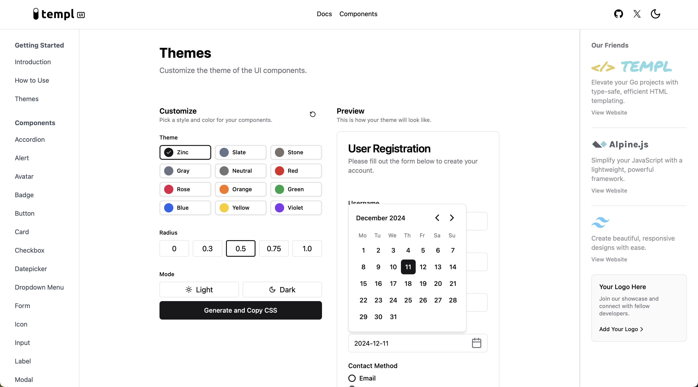

# TemplUI

Modern UI Components for Go & Templ

## About

TemplUI is a growing library of modern UI components designed specifically for Go and Templ. It leverages Alpine.js for enhanced interactivity and Tailwind CSS for effortless styling. Whether you're building a small website or a large web application, TemplUI provides the tools you need to create sleek, responsive interfaces with ease.

## Features

- **Go-native Implementation**: Optimized for Go developers, seamlessly integrating with Go backends.
- **Templ-first Design**: Leverages the full power of Templ for type-safe, high-performance templating.
- **Server-Side Rendering (SSR) Focus**: Excellent performance and SEO benefits out of the box.
- **Alpine.js Integration**: Enhanced client-side interactivity when needed.
- **Tailwind CSS Styling**: Modern, utility-first styling that's highly customizable.
- **Accessible Components**: Built with accessibility in mind, following WCAG guidelines.
- **TypeSafe**: Utilizing Go's type system for robust, error-resistant development.

## Quick Start

Visit our [documentation](https://templui.io/docs/how-to-use) for detailed installation and usage instructions.

For a ready-to-go setup, check out our [Quickstart Template](https://github.com/axzilla/templui-quickstart).

## Components

Explore our growing list of components in the [components documentation](https://templui.io/docs/components).

## Inspiration

TemplUI draws inspiration from several popular UI libraries and frameworks:

- [shadcn/ui](https://ui.shadcn.com/)
- [Pines UI](https://devdojo.com/pines)
- [daisyUI](https://daisyui.com/)

We're exploring whether to make TemplUI a strict port of shadcn/ui or to create a unique blend of various inspirations. The project is still evolving, and community feedback will play a crucial role in shaping its direction.

## Current Status

- **Heavy Development**: The project is under active development. Expect frequent updates and potential breaking changes until we reach a stable version.
- Actively growing component library
- Regular updates and bug fixes
- Continuous development based on community feedback

## Contributing

We welcome contributions from the community! Whether it's adding new components, improving existing ones, or enhancing documentation, your input is valuable. Please check our [contributing guidelines](CONTRIBUTING.md) for more information on how to get involved.

## License

TemplUI is open-source software licensed under the [MIT license](LICENSE).

## Support

For support, questions, or discussions, please [open an issue](https://github.com/axzilla/templui/issues) on our GitHub repository or [visit our community (GitHub Discussions)](https://github.com/axzilla/templui/discussions).

---

Built with ❤️ by the Go community, for the Go community.
